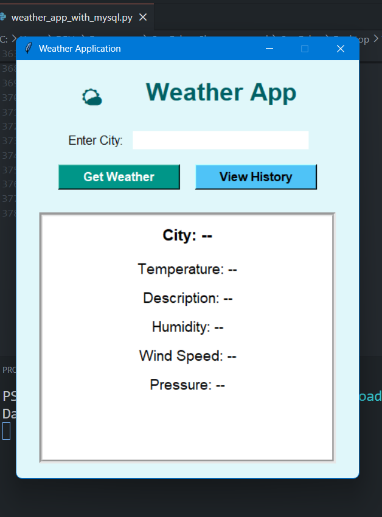
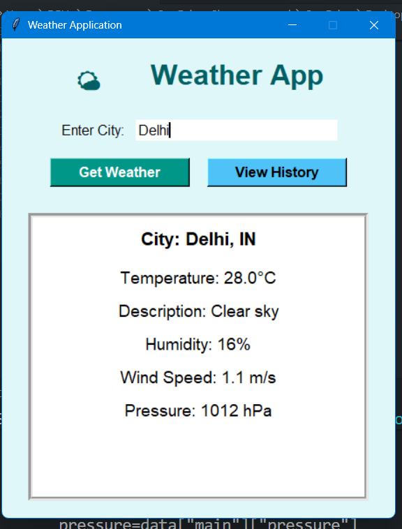

# 🌦️ Weather Application

A **Python Tkinter-based desktop Weather Application** that retrieves real-time weather data using the **OpenWeatherMap API**.

The application allows users to enter a city name and instantly view weather information through a clean graphical interface.

---

## 🚀 Features

* Search weather by city name
* Displays temperature, humidity, pressure, and wind speed
* Simple and user-friendly GUI using Tkinter
* Stores search history using MySQL database
* Real-time weather updates using OpenWeatherMap API

---

## 🛠️ Technologies Used

* **Python**
* **Tkinter** (GUI)
* **MySQL**
* **OpenWeatherMap API**

---

## 📂 Project Structure

Weather-Application-Text
│
├── screenshots/
│   ├── home_screen.png
│   └── weather_result.png
│
├── .gitignore
├── README.md
├── main.py
└── weather_app_with_mysql.py

---

## 📸 Screenshots

### Home Screen



### Weather Result



---

## ▶️ How to Run the Project

1. Clone the repository

```bash
git clone https://github.com/yourusername/Weather-Application.git
```

2. Install required libraries

```bash
pip install requests mysql-connector-python
```

3. Run the application

```bash
python weather_app_with_mysql.py
```

---

## 📌 Future Improvements

* Add 5-day weather forecast
* Improve UI design
* Add weather icons and animations
* Deploy as a web application

---

## 👩‍💻 Author

**Shreya Khurana**
B.Tech CSE (AI & ML)
